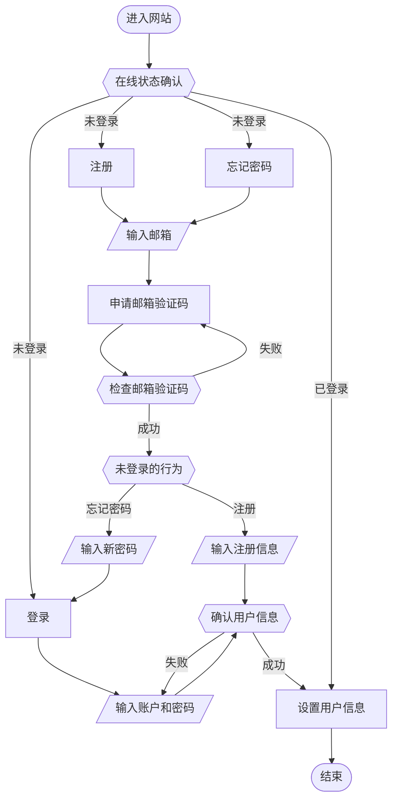
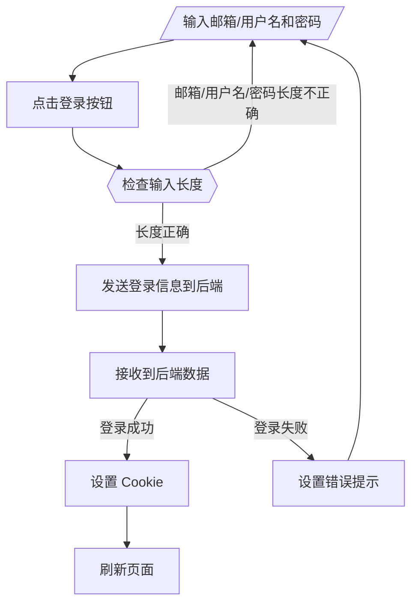
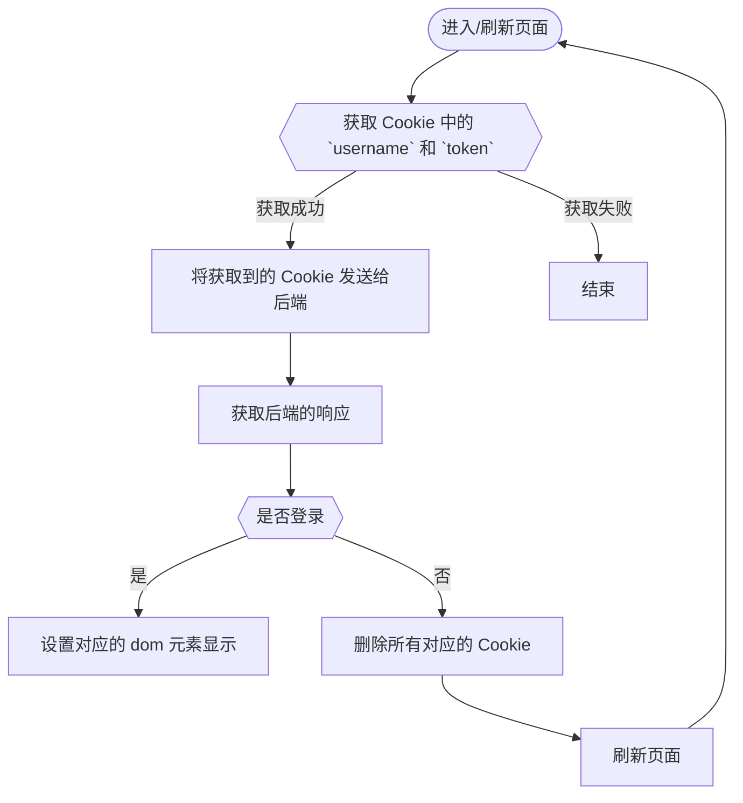

# 用户操作设计
## 数据库表
### 用户权限表
|名称|类型|描述|
|-|-|-|
|`auth_id`|`int unsigned`|权限在数据库中唯一的 ID|
|`auth_level`|`int`|权限等级，越低权限越高|
|`auth_name`|`varchar(100)`|权限名称|

### 用户表
|名称|类型|描述|
|-|-|-|
|`user_id`|`INT UNSIGNED`|用户在数据库中的唯一 ID|
|`email`|`VARCHAR(254)`|用户在数据库中的邮箱，具有唯一性|
|`user_name`|`VARCHAR(20)`|用户在数据库中的用户名，具有唯一性|
|`password`|`VARCHAR(100)`|用户密码|
|`regist_time`|`DATETIME`|用户注册时间，非空|
|`auth_id`|`INT UNSIGNED`|用户的权限，非空，外键|
|`user_nickname`|`VARCHAR(100)`|用户昵称|
|`lastest_sign`|`DATETIME`|用户最后登录时间|
|`avatar`|`VARCHAR(100)`|用户头像链接|
|`token`|`varbinary(16)`|用户 Token|
|`description`|`TEXT`|用户简介|

## 行为表
|行为|路径|方法|前端发送数据|后台返回数据|数据项说明|
|---|---|---|---|---|---|
|申请邮箱验证码|`/user/require-email-code`|`POST`|`{"email":String, ["check_user_rule":'no-check' / 'no-exist' / 'is-exist']}`|`{"message":String} / {"responseText":String}`|`check_user_rule`，设置检查用户邮箱时的规则，默认为不检查，直接发送邮件；'no-exist' 只有在检查不存在时才会发送邮件；'is-exist' 只有在检查存在时才会发送邮件。成功发送会返回 `{"message":String}`，否则返回 `{"responseText":String}`|
|检查邮箱验证码|`/user/check-email-code`|`POST`|`{"email":String, "code":Number, ["delete_code":bool]}`|`{"success":bool, ["responseText":String]}`|`delete_code` 表示是否在检查验证码后删除该验证码，默认为 `false`|
|注册|`/user/sign-up`|`POST`|`{"user_name":String, "email":String, "code":Number,"password":String }`|`{"user":{"user_name":String, "user_nickname":String, "avatar":String, "token":String}}` 或 `{"error":[]}`|`error` 中存储出现错误的用户字段，出现用户字段错误一般情况下为数据重复，特殊情况下会有 `unknow` 错误|
|登录|`/user/sign-in`|`POST`|`{"name":String, "password":String}`|`{"user":{"user_name":String, "user_nickname":String, "avatar":String, "token":String}}`|`name` 可以为用户名，也可以是邮箱|
|在线状态确认|`/user/online-check`|`POST`|`{"user_name":String, "token":String}`|`{"check_online":bool}`||
|用户资料获取|`/user/profiles/get`|`GET`|`?user_name=`|`{"avatar":String, "user_nickname":String, "regist_time":String, "description":String}`|传入参数在链接的 `?` 后|
|更新昵称|`/user/profiles/update/nickname`|`GET`|`?user_nickname=<name>`|`{"user_nickname":String}`|返回新的昵称，返回类型为 `json`|
|更新昵称和简介|`/user/profiles/update/profiles`|`GET`|`?user_nickname={name}&description={description}`|`{"user_nickname":String, "description":String}`|返回新的昵称和简介，返回类型为 `json`|
|更新头像|`/user/profiles/update/avatar/{filename}`|`POST`|`FormData: {file: File}`|`{"avatar":String}`|返回新的头像链接，返回类型为 `json`|
|更新密码|`/user/profiles/update/password`|`POST`|`{"email":String, "code":i32, "password":String}`|`{"message":String} / {"responseText":String}`|返回是否修改成功，修改成功，则返回 `{"message":String}`，否则返回 `{"responseText":String}`|
|获取用户发布的所有帖子|`/user/profiles/posts/get`|`get`|`?user_name=`|`{"posts":[{"post_id":Number,"post_title":String, "post_summary":String, "section_name":String, "section_name_zh":String, "post_time":String, "post_update_time":String, "comment_count":Number}]}`|因为为同一用户，所以返回中不带发帖用户信息|
|删除用户发布的帖子|`/user/profiles/posts/del`|`post`|`{"post_id":Vec<i32>}`|`{"success":Boolean, ["responseText":String]}`|当出现错误或 `success` 的值为 `false` 时，返回的数据中会带有 `responseText`|

## 流程图

## 注册
### 用户注册步骤
#### 前端步骤
1. 输入邮箱；
2. 发送邮箱数据到后端，检测数据库中是否已经注册该邮箱；
3. 未注册，则发送验证码到用户输入邮箱；
   > 发送过一次验证码之后，设置发送验证码按钮为禁止状态，并在 60 秒之后恢复。
4. 验证码确认通过后，需要用户输入用户名和密码；
   > 密码需要再次确认，并且长度需要大于8位，且需要拥有大写、小写、数字和特殊字符四项中的三项。
5. 在确认用户名没有重名之后，并且密码符合要求后，会提示更换头像和昵称；
   > 头像和昵称并不是必填项，所以可以不填直接确定。如果昵称为空，视为昵称使用用户名。
6. 在确认昵称和头像之后，注册的数据会发送给后端服务器。当后端服务器返回入库完成的确认信息，则为注册完成。此时会刷新当前页面；否则显示错误信息；
7. 后端返回的数据中，期望的数据内容有用户头像链接、用户 token 和用户名、用户昵称；
8. 用户名、头像链接、用户昵称和 token 将会存储在 Cookie 中。

#### 后端步骤
1. 收到发送邮箱验证码请求，查找数据库，确认邮箱是否被注册；
2. 邮箱如被注册，则返回错误信息，否则发送邮箱验证码，并给前端返回已发送验证码的信息；
3. 后端收到用户注册时使用的用户名，在数据库中查找，如果存在该用户名，则返回错误信息，否则返回可注册信息；
4. 后端收到用户完整信息（邮箱、用户名、昵称、头像、密码），并将注册信息入库；
   > 入库的注册信息除了**邮箱、用户名、昵称、头像、密码**，还会记录注册的时间。
5. 入库失败，则返回注册失败的信息；
6. 入库成功，则生成一个 token，并将当前时间作为登录时间入库。将用户名、用户昵称、用户头像链接、token序列化成 `json` 数据返回给前端。

## 登录
### 用户登录步骤
#### 前端步骤
1. 输入邮箱/用户名和密码；
2. 将登录信息发送给后端；
3. 接收后端返回的信息，如果登录失败，则根据错误信息提示；如果登录成功，则关闭登录窗口；
4. 将用户名、头像链接、用户昵称和 token 将会存储在 Cookie 中。

#### 流程图

#### 后端步骤
1. 接收到前端发送的登录信息；
2. 根据登录信息在数据库中查找；
3. 查找到对应用户条目，则返回用户名、头像链接、用户昵称和 token 数据给前端，否则返回错误信息。

### 用户在线状态确认
#### 前端步骤
1. 将 token 和用户名发送给后端；
2. 接收后端返回的数据，如果用户确认失败，则删除当前存储的所有 Cookie；
3. 如果确认成功，则将从 Cookie 中读取的其他信息，设置到 vue 对象中。

#### 流程图

#### 后端步骤
1. 接收 token 和用户名；
2. 查找数据库，如果存在，则返回确认成功，否则返回确认失败。

## 信息修改
### 忘记密码
#### 前端步骤
1. 输入邮箱或用户名；
2. 发送输入信息给后端；
3. 输入验证码；
4. 发送验证码给后端；
5. 接收确认信息，如果验证码正确则进行下一步；
6. 输入两边新密码，并将密码发送给后端；
7. 

#### 后端步骤